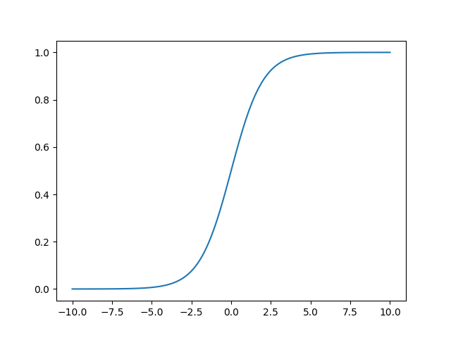
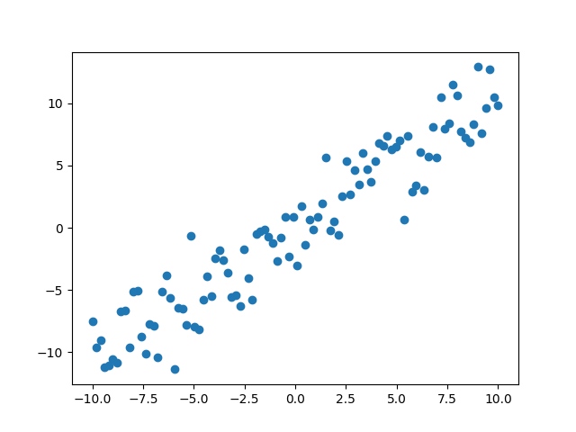
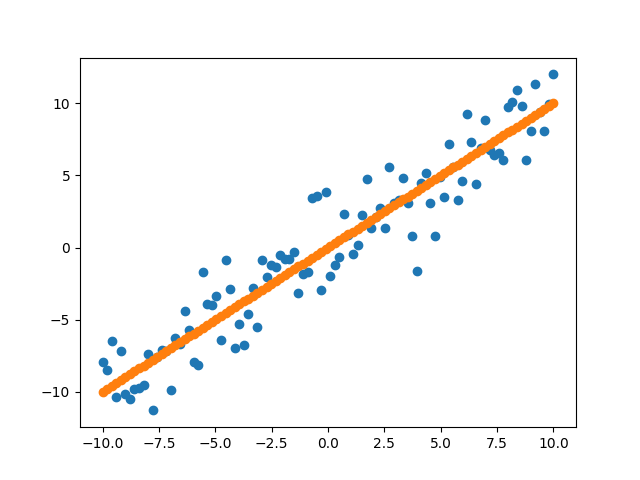

# Neural Networks

## Basics

What is a neural network? I believe you have seen a picture like this before, perhaps many times.


Multi-layer perceptrons and neural networks are used in literature interchangeably. However, more concretely speaking, MLP is subset of neural networks. in general if you see a neural network that is feed-forward only, i.e. no cycles, then you are safe to call it a multi-layer perceptrons \(MLP\), otherwise they would be recurrent networks. For the purpose of introduction to neural networks, I will focus mainly on MLP. 

A neural network takes inputs and produces outputs. On the high level we can think of it as a function that takes inputs and computes outputs, using a set of hidden parameters. Let $$w$$ denote the hidden parameters, also known as weights. Let $$\vec{x}$$ denote our vector inputs and $$\vec{y}$$ denote our vector outputs. 

$$
f_w(\vec{x}) =\vec{y}
$$

In the simplest example, the neural network can be a linear function.

$$
f_w(\vec{x}) = W_{1}\vec{x} + W_{0}
$$

If input is a scalar, i.e. single dimensional vector, then we have the familiar equation of a line.

$$
f(x) = y = mx + b
$$

However, in practice, a neural network does not resemble a line because each layer has a non-linear activation function. Before we talk about non-linearity, let's focus a bit on the linear side first.

## Transformation

Recall that matrix multiplication represents a linear transformation of a vector. In case you need a little brush-up on linear algebra, you should take a look at [3Blue1Brown's lecture series](https://www.3blue1brown.com/essence-of-linear-algebra-page) on _Essence of Linear Algebra_. 

Suppose I want to apply a rotational transformation on a vector via my neural network, my $$W_1$$ would be a rotational matrix and $$W_0$$ is a zero matrix. Let me use the following notation to describe my transformation for better readability in my Python code.

$$
f(\vec{x}) = \vec{x}W_1 + W_0 \quad\text{where}\quad \vec{x} = \begin{vmatrix} 1 & 0 \end{vmatrix}
$$

Then

$$
W_1 = \begin{vmatrix} cos(\theta) & sin(\theta) \\ -sin(\theta) & cos(\theta)\end{vmatrix} \quad\text{and}\quad W_2 = \begin{vmatrix} 0 & 0 \\ 0 & 0 \end{vmatrix}
$$

I want to rotate my vector x by 90 degrees, which is $$\frac{\pi}{2}$$ in radians.

```python
import numpy as np

theta = np.pi / 2

W1 = np.array([
    [np.cos(theta), np.sin(theta)],
    [-np.sin(theta), np.cos(theta)],
])

W0 = np.array([
    [0.0, 0.0],
    [0.0, 0.0],
])

x = np.array([
    [1.0, 0.0],
])

y = np.dot(x, W1) + W0
```

Then the output will be

```text
[[0.0 1.0]]
```

I have rotated my horizontal vector 90 degrees and now it is a vertical vector on a Cartesian plane.

### Affine Transformation

The example above is commonly referred as affine transformation. The $$W_0$$ is known as offsets or **biases**. The generalized form would be describe by the following expression.

$$
\begin{vmatrix} x_0 & x_1 & ... & x_n \end{vmatrix} \begin{vmatrix}
W_{0,0} & W_{0,1} & ... & W_{0, m} \\
W_{1,0} & ... & ... & ... \\
... & ... & ... & ... \\
W_{n, 0} & ... & ... & W_{n, m}
 \end{vmatrix}
 + \begin{vmatrix}
b_{0} & b_{1} & ... & b_{m} 
\end{vmatrix}
$$

### Nonlinear Transformation

The power of neural network is flexibility; it can model any function, linear or nonlinear. Affine transformation only allows us to model linear function, we are missing a nonlinear ingredient in our neural networks to model nonlinear functions. That ingredient is nonlinear transformation, also commonly known as nonlinear activation.

A classical choice is the sigmoid activation. 

$$
\sigma(\vec{x}) = \frac{1}{1 + e^{-\vec{x}}}
$$

However, the more popular choice for very deep neural networks is rectified linear unit, also known as **ReLU**.

```python
from matplotlib import pyplot as plt
import numpy as np


def sigmoid(x):
    return 1.0 / (1.0 + np.exp(-1 * x))


x = np.linspace(-10, 10, num=100)
plt.plot(x, sigmoid(x))
plt.show()
```



When we apply `sigmoid()` to a matrix, the operation is performed element-wise.

## Forward Propagation

### Layer

With affine transformation and sigmoid activation, we can create our first layer of a neural network. It's usually helpful to think each transformation/activation as a computational unit, known as gate. We can simplify the mental model by imagining that inputs pass through different gates.


Mathematically speaking,

$$
\text{sigmoid}(\vec{x}W_1 + W_0) = \vec{y}
$$

We generally call the first layer of a neural network an input layer, subsequent layers hidden layers, and the final layer the output layer . Let  `N` denote the number of inputs, `D` denote our input dimension, and `H` denote our hidden dimension, which is the dimension of the subsequent hidden layer. Although my example is a single vector input, i.e. `N = 1` but in practice you can feed in as many inputs at once as you want for maximizing parallel computation.

```python
import numpy as np


def sigmoid(x):
    return 1.0 / (1.0 + np.exp(-1 * x))


N, D, H = 1, 10, 5

x = np.random.randn(N, D)
W1 = np.random.randn(D, H)
W0 = np.random.randn(H)

# Layer 1
sigmoid(x.dot(W1) + W0)
```

### Many Layers

We can simply stack many layers together to produce an actually useful neural network. Feeding an input to a layer and propagating the output to the next layer as input is known as **forward propagation**. Let `O` denote our output dimension.

```python
import numpy as np


def sigmoid(x):
    return 1.0 / (1.0 + np.exp(-1 * x))


class Layer:
    def __init__(self, in_dim, out_dim):
        self.weight = np.random.randn(in_dim, out_dim)
        self.bias = np.random.randn(out_dim)

    def forward(self, x):
        y = x.dot(self.weight) + self.bias
        return sigmoid(y)


class Network:
    def __init__(self, dims, num_hidden_layers=3):
        D, H, O = dims
        self.layers = [Layer(D, H)]
        for i in range(num_hidden_layers):
            self.layers.append(Layer(H, H))
        self.layers.append(Layer(H, O))

    def forward(self, x):
        for i in range(len(self.layers)):
            x = self.layers[i].forward(x)

        return x


N, D, H, O = 1, 10, 5, 1
x = np.random.randn(N, D)
network = Network((D, H, O), num_hidden_layers=5)
network.forward(x)
```

## Backpropagation

Although our neural network can produce outputs, it does not produce any meaningful output because it is lacking training. We need to give it the ability to learn, hence the term machine learning.

### Linear Regression

Suppose you are given a set of data points, you want to fit a curve that best represents the trend of the data, how would you do it algorithmically?  Here's a simple linear example.

```python
import numpy as np
import matplotlib.pyplot as plt

x = np.linspace(-10, 10, num=100)
y = np.linspace(-10, 10, num=100) + np.random.randn(100,) * 2
plt.plot(x, y, 'o')
plt.show()
```



Since we know the data points were generated linearly, we can simply fit a straight line to them. Recall that equation of a line is $$y = mx + b$$. We need a way to figure out the values of $$m$$ and $$b$$. A naive approach is to guess.

```python
def linear_model(m, b, x):
    return m * x + b
    
plt.plot(x, y, 'o', x, linear_model(1, 0, x), 'o')
plt.show()
```



